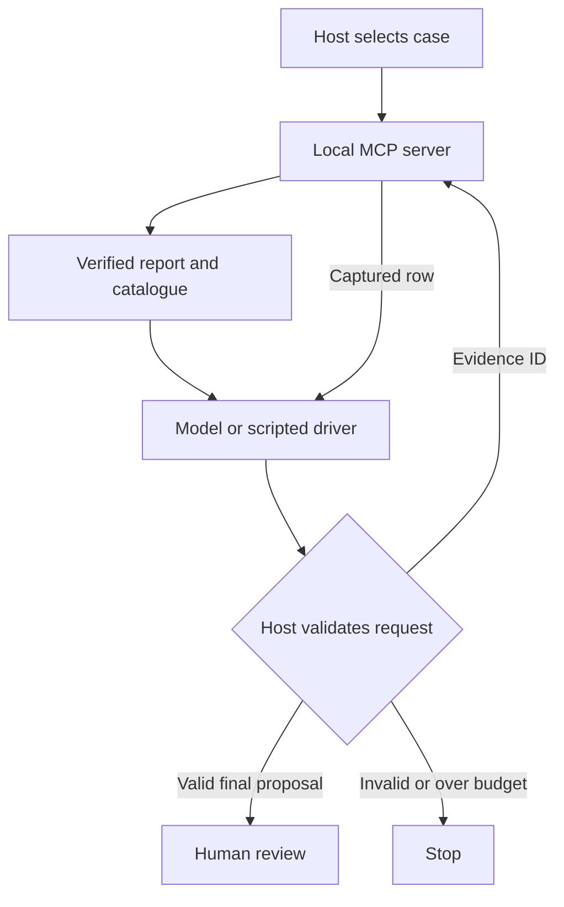

# ADR 0005: one bounded investigator, host-controlled MCP calls

Status: implemented for 0.0.5 on 21 September 2026; live model acceptance pending.

## Context and decision

The deterministic report already calculates facts and expresses allowed
uncertainties. The first model-assisted increment should exercise actual tool
selection without giving a model control over case scope, financial arithmetic,
or execution authority. Introduce one bounded investigator with a replaceable
decision-model interface. The live implementation uses OpenAI Responses function
calling through the existing pinned HTTP client. An explicit scripted driver
exercises the same loop offline.

The host loads the case and report in one trusted local MCP session. It checks
their case/version agreement and report content digest. This is response
consistency checking, not source attestation; the local server remains trusted
to perform the report verification introduced in ADR 0004.

The model sees two function definitions:

| Function | Host behaviour |
| --- | --- |
| `get_evidence(evidence_id)` | Validate the ID, inject the fixed case/version, and call MCP |
| `submit_investigation(proposal)` | Validate locally and finish; no MCP mutation |

The MCP server still has its existing four read-only tools. The model-facing
function schemas are an adapter boundary, not an additional MCP server. The
model receives no shell, URL, file path, payment, posting, or approval tool.

## Proposal contract

The proposal identifies its case, version, and deterministic report. It carries
all report finding IDs and exact integer amounts (or the prescribed null value),
evidence IDs, and ordered codes for hypotheses, unresolved questions, and human
information requests. Every applicable playbook item must remain present exactly
once. Every row citation used by the report must have been inspected in this run
and included in the proposal. An unrelated row cannot replace a required one.

For a case requiring review, the conclusion is always `cause_undetermined`.
For balanced supplied records, it is `no_discrepancy_in_supplied_records` and the
external-completeness question remains. There is no free-form diagnostic text.
Rendering uses trusted fixed wording, preserving every hypothesis as unverified.
The model's useful decision space is evidence selection and priority order.

This deliberately narrow contract can reject added causes and altered facts
without pretending to perform general natural-language fact checking. A future
free-text proposal format would require a separate verification claim and evals.
Passing the present contract does not establish the usefulness of the ordering.

## Execution and provider boundary

Only one function call is accepted per model response. The runner rejects unknown
tools, extra arguments, duplicate JSON keys, non-finite numbers, repeated evidence
reads, reused call IDs, unread citations, stale context, and omitted findings.
Limits are six model turns, four evidence reads, twelve findings, 96 KiB per
provider request, 256 KiB per response, and 180 seconds for a run. The HTTP client
uses phase timeouts and a 4,096 output-token limit; no automatic retry is made.

The optional live adapter posts only to `https://api.openai.com/v1/responses`.
It does not accept custom endpoints, follow redirects, or inherit HTTP proxy
configuration. `store: false` avoids requesting stored Responses state; it is
not itself a zero-data-retention or compliance guarantee. Required provider
reasoning items are replayed in memory for protocol continuity and omitted from
public run output. HTTP tests mock the transport.

Keys are supplied by the operator's environment or a hidden CLI prompt. They
are not added to the MCP child environment, prompts, run objects, or log output.
The SDK uses its pinned standard environment allowlist for the child. Raw
provider error bodies are not printed. Nested MCP task-group errors are reduced
to a single sanitized application error when possible. Failures produce no
accepted plan; there is no silent fallback from live mode to the simulator.

Free-text source descriptions are removed from model evidence payloads. Other
identifiers remain untrusted data. The host tool allowlist and exact proposal
contract constrain operations even if the model follows a malicious suggestion.
This does not demonstrate LLM prompt-injection resistance or priority quality.

## Observability and next evaluation

An accepted run records mode, requested and returned model IDs, provider-reported
token counts, the proposal, deterministic report, and a tool-choice trace.
`contract_status` and `priority_quality` are separate fields. This is an in-memory
execution record, not a durable or tamper-evident audit log. A digest is not a
signature. Failed attempts can consume API quota even though no run is accepted.

After live acceptance, measure proposal acceptance rate, required-evidence
coverage, token usage, latency, and analyst judgments of priorities on held-out
synthetic scenarios. Record the model snapshot and prompt/commit with each eval.
Compare with the deterministic baseline before claiming the model adds value.
Resolution planning, authentication, approvals, durable storage, and multi-agent
coordination remain separate future increments.
